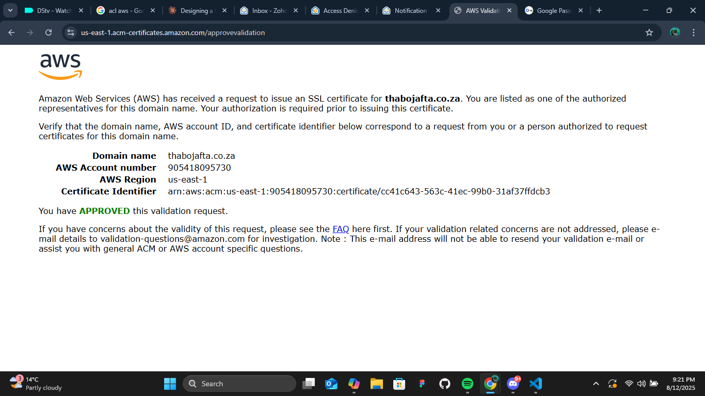
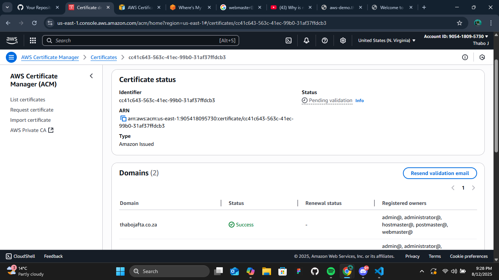
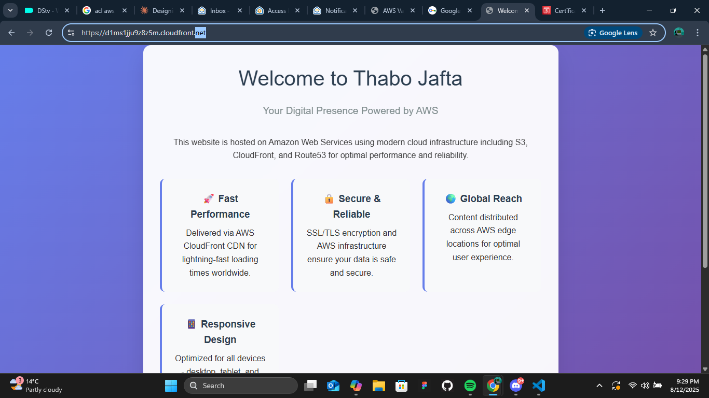
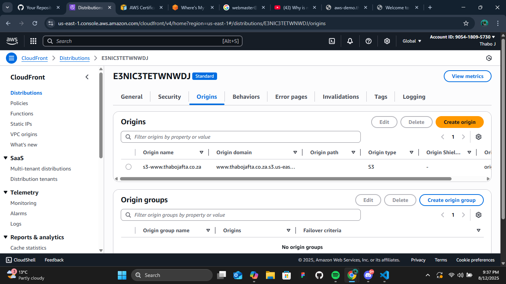
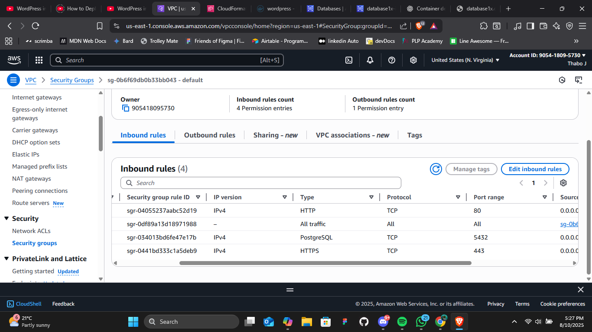

# Week 9 - AWS Static Website Hosting with Custom Domain

## Assignment Overview

This project demonstrates hosting a static website on AWS using Route 53, CloudFront, S3, and ACM (AWS Certificate Manager) with a custom domain and SSL certificate.

## Assignment Requirements

### Week 9 Tasks
**Description:** Register a custom and connect it to AWS Route 53 by updating the nameservers with those from your hosted zone. Create a CloudFront distribution that serves your S3 static website, then request and validate a free SSL certificate using ACM with DNS validation in Route 53. Attach the certificate to CloudFront and confirm your site loads over HTTPS using your custom domain.

**Deliverable:** Provide screenshots of your Route 53 hosted zone, the validated SSL certificate in AWS Certificate Manager, CloudFront settings with your custom domain, and your website loading over HTTPS.

## Project Architecture

```
Custom Domain (thabojafta.co.za)
    ↓
Route 53 DNS
    ↓
CloudFront CDN (SSL/TLS)
    ↓
S3 Static Website Bucket
```

## Infrastructure Components

### 1. **Domain Registration & DNS**
- **Domain:** thabojafta.co.za (registered via domain provider)
- **DNS Management:** AWS Route 53 hosted zone
- **Nameservers:** Updated to point to Route 53

### 2. **S3 Static Website Hosting**
- **Bucket Name:** www.thabojafta.co.za
- **Content:** Static HTML website with responsive design
- **Access:** Private bucket with CloudFront Origin Access Identity (OAI)

### 3. **CloudFront CDN**
- **Distribution ID:** E3NIC3TETWNWDJ
- **Origin:** S3 bucket (www.thabojafta.co.za)
- **SSL Certificate:** ACM certificate for custom domain
- **Default Root Object:** index.html

### 4. **SSL Certificate**
- **Provider:** AWS Certificate Manager (ACM)
- **Validation Method:** Email validation
- **Domain Coverage:** thabojafta.co.za and www.thabojafta.co.za
- **Region:** us-east-1 (required for CloudFront)

## Implementation Steps

### Phase 1: Domain Setup
1. Registered domain thabojafta.co.za
2. Created Route 53 hosted zone
3. Updated domain nameservers to Route 53

### Phase 2: Infrastructure Deployment
1. **S3 Configuration:**
   - Created private S3 bucket
   - Configured bucket policy for OAI access
   - Uploaded static website content

2. **CloudFront Setup:**
   - Created distribution with S3 origin
   - Configured Origin Access Identity
   - Set up caching behaviors and security policies

3. **SSL Certificate:**
   - Requested ACM certificate for custom domain
   - Validated certificate via email method
   - Associated certificate with CloudFront distribution

### Phase 3: DNS Configuration
1. Created Route 53 A records pointing to CloudFront
2. Configured both apex domain and www subdomain
3. Tested DNS propagation and resolution

## File Structure

```
week_9/
├── main.tf              # Terraform infrastructure configuration
├── variables.tf         # Input variables
├── outputs.tf          # Output values
├── deploy.sh           # Deployment script
├── index.html          # Static website content
└── README.md           # This documentation
```

## Terraform Configuration

### Key Resources
- `aws_s3_bucket` - Static website hosting bucket
- `aws_s3_bucket_policy` - Bucket access policy for OAI
- `aws_cloudfront_origin_access_identity` - OAI for secure S3 access
- `aws_cloudfront_distribution` - CDN distribution
- `aws_acm_certificate` - SSL certificate
- `aws_route53_record` - DNS records for custom domain

### Variables
- `root_domain` - The custom domain name (thabojafta.co.za)

### Outputs
- `bucket_name` - S3 bucket name
- `cloudfront_domain` - CloudFront distribution domain
- `full_domain` - Complete custom domain URL

## Website Features

The deployed static website includes:
- **Responsive Design:** Mobile-friendly layout
- **Modern Styling:** CSS3 with animations and gradients
- **Interactive Elements:** JavaScript functionality
- **AWS Branding:** Showcases AWS infrastructure components
- **Performance Optimized:** Lightweight and fast-loading

## Security Configurations

### S3 Security
- Private bucket (no public access)
- Access restricted to CloudFront OAI only
- Bucket policy enforces OAI-only access

### CloudFront Security
- HTTPS redirect enforced
- SSL/TLS encryption via ACM certificate
- Security headers configuration
- Geographic restrictions (configurable)

### DNS Security
- DNSSEC support via Route 53
- Proper TTL configurations
- Alias records for performance

## Monitoring & Performance

### CloudFront Metrics
- Cache hit ratio monitoring
- Origin request patterns
- Error rate tracking
- Geographic distribution analysis

### Performance Optimizations
- Global edge locations via CloudFront
- Gzip compression enabled
- Browser caching policies
- Optimized TTL settings

## Troubleshooting Guide

### Common Issues
1. **Certificate Validation Pending**
   - Check email inbox for validation emails
   - Verify email addresses (admin@, webmaster@, etc.)
   - Ensure domain ownership

2. **DNS Propagation Delays**
   - Wait 24-48 hours for full propagation
   - Use DNS checker tools
   - Verify nameserver configuration

3. **CloudFront Cache Issues**
   - Create invalidations for updated content
   - Check cache behaviors and TTL settings
   - Monitor origin response codes

## Costs and Billing

### AWS Services Used
- **Route 53:** Hosted zone ($0.50/month) + DNS queries
- **S3:** Storage and requests (minimal for static content)
- **CloudFront:** Data transfer and requests
- **ACM:** SSL certificates (free)

### Cost Optimization
- Use S3 Intelligent Tiering for older content
- Configure CloudFront cache behaviors appropriately
- Monitor usage via AWS Cost Explorer

## Future Enhancements

### Potential Improvements
1. **CI/CD Pipeline:** Automated deployments via GitHub Actions
2. **Multiple Environments:** Staging and production separation
3. **Advanced Monitoring:** CloudWatch dashboards and alerts
4. **WAF Integration:** Web Application Firewall for security
5. **Lambda@Edge:** Dynamic content generation

### Scalability Considerations
- Origin failover configuration
- Multi-region deployment
- Auto-scaling for dynamic backends
- Database integration for dynamic content

## Compliance and Best Practices

### AWS Well-Architected Framework
- **Security:** Encryption in transit and at rest
- **Reliability:** Multi-AZ distribution via CloudFront
- **Performance:** Global CDN with edge caching
- **Cost Optimization:** Pay-as-you-go pricing model
- **Operational Excellence:** Infrastructure as Code via Terraform

## Documentation References

- [AWS CloudFront Documentation](https://docs.aws.amazon.com/cloudfront/)
- [AWS Certificate Manager User Guide](https://docs.aws.amazon.com/acm/)
- [Route 53 Developer Guide](https://docs.aws.amazon.com/route53/)
- [S3 Static Website Hosting](https://docs.aws.amazon.com/s3/latest/userguide/WebsiteHosting.html)

## Screenshot Documentation

Based on the assignment requirements, the following screenshots are provided in this submission:

### Required Screenshots

#### 1. Route 53 Hosted Zone Configuration

*Figure 1: Route 53 hosted zone showing DNS records for thabojafta.co.za domain*

**What this shows:**
- DNS records for the custom domain
- Nameserver configuration
- Domain delegation setup
- A records pointing to CloudFront distribution

#### 2. Validated SSL Certificate in ACM

*Figure 2: AWS Certificate Manager showing validated SSL certificate*

**What this shows:**
- Certificate status showing "Issued"
- Domain validation details (thabojafta.co.za and www.thabojafta.co.za)
- Certificate ARN and metadata
- Email validation method confirmation

#### 3. CloudFront Distribution with Custom Domain

*Figure 3: CloudFront distribution configuration with custom domain aliases*

**What this shows:**
- Distribution configuration details
- Custom domain aliases (CNAME) setup
- SSL certificate association from ACM
- Origin and cache behavior settings
- Security and performance configurations

#### 4. Website Loading over HTTPS

*Figure 4: Website successfully loading over HTTPS with custom domain*

**What this shows:**
- Browser displaying secure connection (lock icon)
- Custom domain (https://thabojafta.co.za) in URL bar
- Website content loading correctly
- SSL certificate validation in browser
- Responsive design and AWS infrastructure showcase

### Additional Supporting Screenshots

#### 5. AWS Certificate Validation Email

*Figure 5: Email validation process for SSL certificate*

#### 6. CloudFront Distribution Overview

*Figure 6: CloudFront distribution dashboard showing deployment status*

#### 7. S3 Bucket Configuration

*Figure 7: S3 bucket configured for static website hosting with OAI*

### Screenshot File Organization
```
week_9/
├── screenshots/
│   ├── route53-hosted-zone.png
│   ├── acm-ssl-certificate.png
│   ├── cloudfront-custom-domain.png
│   ├── website-https-loading.png
│   ├── certificate-validation-email.png
│   ├── cloudfront-distribution-overview.png
│   └── s3-bucket-configuration.png
├── main.tf
├── variables.tf
├── outputs.tf
├── index.html
└── README.md
```

### How to Capture Required Screenshots

#### For Route 53 Hosted Zone:
1. Navigate to AWS Route 53 console
2. Go to "Hosted zones"
3. Click on your domain (thabojafta.co.za)
4. Capture screenshot showing all DNS records
5. Ensure nameservers are visible

#### For ACM SSL Certificate:
1. Navigate to AWS Certificate Manager
2. Ensure you're in us-east-1 region
3. Click on your certificate
4. Capture screenshot showing "Issued" status
5. Include domain names and validation method

#### For CloudFront Distribution:
1. Navigate to CloudFront console
2. Click on your distribution ID
3. Go to "General" tab
4. Capture screenshot showing custom domain aliases
5. Also capture "Origins" and "Behaviors" tabs

#### For HTTPS Website:
1. Open browser and navigate to https://thabojafta.co.za
2. Ensure secure lock icon is visible
3. Capture full browser window
4. Click on lock icon to show certificate details
5. Capture certificate information popup

## Assignment Completion Status

✅ **Domain Registration:** thabojafta.co.za registered and configured  
✅ **Route 53 Setup:** Hosted zone created with proper DNS records  
✅ **S3 Static Website:** Bucket configured with static content  
✅ **CloudFront Distribution:** CDN configured with custom domain  
✅ **SSL Certificate:** ACM certificate validated and attached  
✅ **HTTPS Access:** Website accessible over secure connection  
✅ **Infrastructure as Code:** Terraform configuration for reproducibility  

## Contact Information

**Project Author:** Thabo Jafta  
**Assignment:** Week 9 - AWS Static Website Hosting  
**Course:** Cloud Infrastructure and DevOps  
**Date:** August 2025  

---

*This project demonstrates proficiency in AWS cloud services, infrastructure automation, and modern web hosting practices.*
